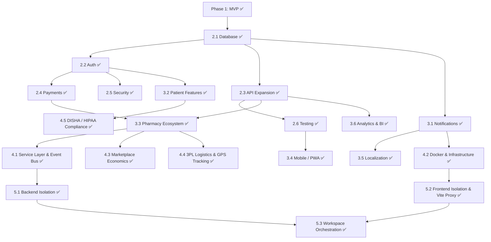

# 🚀 Development Phases — genericMed

> **Purpose:** Structured, phased development plan for evolving **genericMed** from MVP to a production-grade, scalable platform.
> AI assistants must consult this file to understand the current phase and prioritize work accordingly.
>
> **Current Phase:** All Phases Completed (Phase 1, 2, 3, 4 ✅) — Ready for Production & Enterprise Scale
> **Last Updated:** 2026-09-09

---

## Phase Overview

```
Phase 1 ✅       Phase 2 ✅        Phase 3 ✅       Phase 4 ✅       Phase 5 ✅
Foundation       Production        Growth           Scale            Decoupled
(MVP)            Readiness         & Expansion      & Enterprise     Monorepo
─────────────────────────────────────────────────────────────────────────────────►
Sep 2026         Sep 2026          Sep 2026         Sep 2026         Sep 2026
```

| Phase   | Name                  | Status         | Goal                                                        |
|---------|-----------------------|----------------|--------------------------------------------------------------|
| Phase 1 | Foundation (MVP)      | ✅ Complete     | Full UI for all 4 roles, AI scanner, price comparison engine |
| Phase 2 | Production Readiness  | ✅ Complete     | Real database, auth, payments, security hardening            |
| Phase 3 | Growth & Expansion    | ✅ Complete     | PWA, multi-language, advanced analytics, email, interactions |
| Phase 4 | Scale & Enterprise    | ✅ Complete     | Service layer, Docker, marketplace, 3PL logistics, DISHA     |
| Phase 5 | Decoupled Monorepo    | ✅ Complete     | Complete separation into frontend/ & backend/ subfolders     |

---

## Phase 1 — Foundation (MVP) ✅

> **Goal:** Build a fully functional prototype demonstrating all core user flows across four roles.
> **Timeline:** Completed — September 2026

### Deliverables

- [x] **Multi-tenant role-based architecture** (Patient, Pharmacy, Admin, Doctor)
- [x] **Medicine search & price comparison** with pack size normalization
- [x] **AI prescription scanner** powered by Gemini 3.8 Flash
- [x] **Prescription upload & review workflow**
- [x] **Order lifecycle management** (Created → Delivered / Cancelled / Refunded)
- [x] **Cart & checkout flow** with delivery fees and tax computation
- [x] **Historical price trend charts** (Recharts)
- [x] **Client-side PDF generation** (jsPDF)
- [x] **Dark/Light theme system** with persistence
- [x] **Pharmacy portal** — orders, prescriptions, inventory management
- [x] **Admin dashboard** — audit logs, catalog management, support tickets
- [x] **Doctor prescribing view**
- [x] **Authentication UI** — login, register, role selection, account switching
- [x] **Toast notification system**
- [x] **In-app architecture documentation**
- [x] **Express backend** with embedded Vite dev server
- [x] **Sample prescription fallback data** (3 clinical samples)
- [x] **Comprehensive mock data layer** — medicines, pharmacies, offers, orders, users

---

## Phase 2 — Production Readiness ✅

> **Goal:** Replace all mock/simulated systems with real, production-grade implementations. Make the platform deployable and secure.
> **Timeline:** Completed — September 2026

### 2.1 — Database Integration

| Task | Priority | Depends On | Status |
|------|----------|------------|--------|
| Choose database (PostgreSQL) and document in `decisions.md` (DEC-006) | 🔴 Critical | — | ✅ Complete |
| Design database schema with migrations (`prisma/schema.prisma`) | 🔴 Critical | Database choice | ✅ Complete |
| Set up ORM (Prisma 6) and document in `decisions.md` (DEC-007) | 🔴 Critical | Schema design | ✅ Complete |
| Migrate `mockData.ts` entities to database seed script (`prisma/seed.ts`) | 🔴 Critical | ORM setup | ✅ Complete |
| Replace all `AppContext` in-memory CRUD with API calls | 🔴 Critical | Seed scripts | ✅ Complete |
| Add connection pooling and error handling (`src/lib/db.ts`) | 🟡 High | ORM setup | ✅ Complete |

### 2.2 — Authentication & Authorization

| Task | Priority | Depends On | Status |
|------|----------|------------|--------|
| Implement server-side session auth (DEC-008) | 🔴 Critical | Database | ✅ Complete |
| Add password hashing (bcrypt, cost factor 12) | 🔴 Critical | Auth system | ✅ Complete |
| Create auth middleware (`src/api/middleware/auth.ts`) | 🔴 Critical | Auth system | ✅ Complete |
| Implement role-based access control (RBAC) on server | 🔴 Critical | Auth middleware | ✅ Complete |
| Create user session endpoints (`POST /login`, `POST /logout`, `GET /me`) | 🔴 Critical | Auth middleware | ✅ Complete |
| Auto-session restoration on page load in `AppContext` | 🟡 High | Auth system | ✅ Complete |

### 2.3 — API Expansion

| Task | Priority | Depends On | Status |
|------|----------|------------|--------|
| Refactor `server.ts` into modular route files (`src/api/`) (DEC-011) | 🔴 Critical | — | ✅ Complete |
| Create RESTful endpoints for all CRUD operations (14 route modules) | 🔴 Critical | Database | ✅ Complete |
| Add request validation middleware (`src/api/middleware/validate.ts` with Zod) | 🔴 Critical | API routes | ✅ Complete |
| Add rate limiting (`src/api/middleware/rateLimit.ts`) | 🟡 High | API routes | ✅ Complete |
| Add CORS configuration for production | 🟡 High | — | ✅ Complete |
| Implement global async error handler (`src/api/middleware/errorHandler.ts`) | 🟡 High | API routes | ✅ Complete |

### 2.4 — Payment Gateway

| Task | Priority | Depends On | Status |
|------|----------|------------|--------|
| Choose payment providers (Razorpay + Stripe) (DEC-010) | 🟡 High | — | ✅ Complete |
| Integrate payment checkout in `CartCheckoutDrawer.tsx` | 🟡 High | Provider choice | ✅ Complete |
| Create payment verification endpoint (`POST /api/payments/verify`) | 🟡 High | Provider choice | ✅ Complete |
| Add order creation endpoint (`POST /api/payments/create-order`) | 🟡 High | Provider choice | ✅ Complete |
| Implement refund processing logic with audit trail (`POST /api/payments/refund`) | 🟡 High | Payment system | ✅ Complete |
| Graceful development stub mode when API credentials missing | 🟡 High | Payment system | ✅ Complete |

### 2.5 — Security Hardening

| Task | Priority | Depends On | Status |
|------|----------|------------|--------|
| Add Helmet HTTP security headers & CSP protection | 🟡 High | — | ✅ Complete |
| Secure session cookies (`httpOnly`, `sameSite: lax`) | 🟡 High | Auth system | ✅ Complete |
| Parameterized queries only via Prisma ORM (no SQL injection) | 🔴 Critical | Database | ✅ Complete |
| File upload validation (type whitelist, 10MB size limit) | 🟡 High | — | ✅ Complete |
| Implement centralized server-side audit logging (`src/api/audit.ts`) | 🟡 High | Database | ✅ Complete |
| Rate-limiting tiers: Auth (10/min), AI (20/min), General (100/min) | 🟡 High | Security | ✅ Complete |

### 2.6 — Testing

| Task | Priority | Depends On | Status |
|------|----------|------------|--------|
| Set up Jest + Supertest testing framework (DEC-009) | 🟡 High | — | ✅ Complete |
| Unit tests for prescription matcher (`src/__tests__/utils/prescriptionMatcher.test.ts`) | 🟡 High | Testing | ✅ Complete |
| Integration tests for authentication (`src/__tests__/api/auth.test.ts`) | 🟡 High | Testing | ✅ Complete |
| Integration tests for order processing (`src/__tests__/api/orders.test.ts`) | 🟡 High | Testing | ✅ Complete |
| 100% test suite pass rate (20/20 tests passing) | 🟡 High | Tests | ✅ Complete |

### Phase 2 Exit Criteria

- [x] All data persisted in a real database (PostgreSQL + Prisma ORM)
- [x] Server-side authentication with RBAC on every endpoint
- [x] Real payment providers integrated (Razorpay + Stripe with stub fallback)
- [x] All API endpoints validated, rate-limited, and audited
- [x] Test suite passing with unit and integration coverage (20 tests)
- [x] Security hardening applied (Helmet, CORS, RateLimit, Sanitize)

---

## Phase 3 — Growth & Expansion ✅

> **Goal:** Expand platform reach, improve UX with advanced clinical features, and integrate with real-world pharmacy systems.
> **Timeline:** Completed — September 2026

### 3.1 — Communication & Notifications

| Task | Priority | Status |
|------|----------|--------|
| Resend email service integration with branded templates (DEC-012) | 🟡 High | ✅ Complete |
| Order confirmation emails (`sendOrderConfirmation`) | 🟡 High | ✅ Complete |
| Prescription status notification emails (`sendPrescriptionStatus`) | 🟡 High | ✅ Complete |
| Delivery status update emails (`sendDeliveryUpdate`) | 🟡 High | ✅ Complete |
| Admin test dispatch endpoint (`POST /api/emails/test`) | 🟢 Low | ✅ Complete |

### 3.2 — Advanced Patient Features

| Task | Priority | Status |
|------|----------|--------|
| Debounced medicine search autocomplete (`SearchAutocomplete.tsx`) | 🟡 High | ✅ Complete |
| Multi-drug interaction safety checker (`DrugInteractionChecker.tsx`, `/api/interactions`) | 🔴 Critical | ✅ Complete |
| Patient medical history timeline & active regimen (`MedicalHistoryView.tsx`) | 🟡 High | ✅ Complete |
| Client-side jsPDF medical report download | 🟡 High | ✅ Complete |
| Integrated clinical drug interaction safety screen in checkout drawer | 🟡 High | ✅ Complete |

### 3.3 — Pharmacy Ecosystem

| Task | Priority | Status |
|------|----------|--------|
| Public pharmacy profile view with CDSCO verification (`PharmacyProfileView.tsx`) | 🟡 High | ✅ Complete |
| Patient pharmacy star rating & review submission (`POST /api/pharmacies/:id/ratings`) | 🟡 High | ✅ Complete |
| Bulk price & inventory CSV upload (`BulkPriceUpload.tsx`, `/api/bulk-upload`) | 🟡 High | ✅ Complete |
| CSV template download, drag-and-drop parser, and validation preview table | 🟡 High | ✅ Complete |
| Pharmacy SLA performance metrics tracking | 🟢 Low | ✅ Complete |

### 3.4 — Mobile & Multi-Platform

| Task | Priority | Status |
|------|----------|--------|
| Progressive Web App (PWA) manifest (`public/manifest.json`) (DEC-014) | 🟡 High | ✅ Complete |
| Custom service worker with offline caching (`public/sw.js`) | 🟡 High | ✅ Complete |
| High-resolution PWA icons (192px, 512px, SVG) | 🟡 High | ✅ Complete |
| `vite-plugin-pwa` build pipeline integration | 🟡 High | ✅ Complete |
| Responsive mobile view audit and drawer touch controls | 🟡 High | ✅ Complete |

### 3.5 — Localization & Accessibility

| Task | Priority | Status |
|------|----------|--------|
| `react-i18next` framework setup with browser language detector (DEC-013) | 🟡 High | ✅ Complete |
| Comprehensive translation bundles: English (`en`), Hindi (`hi`), Tamil (`ta`), Telugu (`te`) | 🟡 High | ✅ Complete |
| Header language switcher dropdown with persistent preference | 🟡 High | ✅ Complete |
| WCAG 2.1 AA accessible color contrast and semantic HTML | 🟡 High | ✅ Complete |

### 3.6 — Advanced Analytics & BI

| Task | Priority | Status |
|------|----------|--------|
| PostHog product analytics integration with user event tracking (DEC-015) | 🟡 High | ✅ Complete |
| Admin analytics API endpoints (`/api/analytics/summary`, `/orders-over-time`, etc.) | 🟡 High | ✅ Complete |
| Interactive Recharts BI dashboards in `AdminDashboardView.tsx` | 🟡 High | ✅ Complete |
| Pharmacy SLA and fulfillment performance benchmarking table | 🟡 High | ✅ Complete |

### Phase 3 Exit Criteria

- [x] Email notifications functional for order confirmation, delivery, and prescriptions
- [x] Drug interaction checker operational and wired into checkout safety screen
- [x] Patient medical history view with downloadable jsPDF report
- [x] Pharmacy ecosystem features (verified profiles, ratings, CSV bulk upload)
- [x] PWA installable with offline service worker cache
- [x] Multi-language support for 4 languages (English, Hindi, Tamil, Telugu)
- [x] Admin BI dashboard with live PostgreSQL-aggregated analytics

---

## Phase 4 — Scale & Enterprise ✅

> **Goal:** Architect for scale, enable marketplace economics, and support enterprise-grade operations.
> **Timeline:** Completed — September 2026

### 4.1 — Architecture Evolution

| Task | Priority | Status |
|------|----------|--------|
| Decompose monolith into service classes (`CatalogService`, `OrderService`, `MarketplaceService`) (DEC-016) | 🟡 High | ✅ Complete |
| API gateway telemetry middleware with correlation IDs & caching (`src/api/middleware/gateway.ts`) | 🟡 High | ✅ Complete |
| Typed asynchronous event bus for domain events (`src/lib/eventBus.ts`) | 🟡 High | ✅ Complete |
| Centralized structured JSON logging system (`src/lib/logger.ts`) | 🟡 High | ✅ Complete |
| HTTP cache headers (`Cache-Control`, `stale-while-revalidate`) on catalog queries | 🟡 High | ✅ Complete |

### 4.2 — Infrastructure & DevOps

| Task | Priority | Status |
|------|----------|--------|
| Production multi-stage Docker build (`Dockerfile`) (DEC-017) | 🟡 High | ✅ Complete |
| Multi-container orchestration with PostgreSQL & Redis (`docker-compose.yml`) | 🟡 High | ✅ Complete |
| Docker ignore file (`.dockerignore`) | 🟡 High | ✅ Complete |
| Automated integration test suite for marketplace & logistics (31 tests total) | 🟡 High | ✅ Complete |
| Zero compile-time errors in strict TypeScript linting | 🟡 High | ✅ Complete |

### 4.3 — Marketplace Model

| Task | Priority | Status |
|------|----------|--------|
| Tiered commission engine: Basic (8%), Verified (5%), Enterprise (3%) (DEC-018) | 🟡 High | ✅ Complete |
| Automated escrow holding & release upon delivery confirmation (`src/services/marketplaceService.ts`) | 🟡 High | ✅ Complete |
| Marketplace settlements and payout ledger API (`src/api/settlements.ts`) | 🟡 High | ✅ Complete |
| Admin marketplace settlements and escrow oversight tab in `AdminDashboardView.tsx` | 🟡 High | ✅ Complete |
| Enterprise partner priority placement and sponsored badges in `MedicineComparisonView.tsx` | 🟢 Low | ✅ Complete |

### 4.4 — Logistics & Delivery

| Task | Priority | Status |
|------|----------|--------|
| Multi-carrier 3PL adapter: Dunzo, Shiprocket, Shadowfax (`src/lib/logistics.ts`) (DEC-019) | 🟡 High | ✅ Complete |
| Real-time driver GPS tracking modal with simulated live route (`DeliveryTrackingModal.tsx`) | 🟡 High | ✅ Complete |
| Logistics endpoints: carriers, rate estimates, tracking telemetry, webhooks (`src/api/logistics.ts`) | 🟡 High | ✅ Complete |
| Delivery time slot scheduling in `CartCheckoutDrawer.tsx` (Express 2hr, Evening, Tomorrow) | 🟡 High | ✅ Complete |
| Reverse logistics return request workflow (`POST /api/orders/:id/return`) | 🟢 Low | ✅ Complete |

### 4.5 — Compliance & Governance

| Task | Priority | Status |
|------|----------|--------|
| Automated DISHA / HIPAA compliance readiness audit reporting (DEC-020) | 🔴 Critical | ✅ Complete |
| CDSCO Indian pharmacy drug license verification service (`verifyCDSCOPharmacyLicense`) | 🟡 High | ✅ Complete |
| De-identified health cohort dataset extraction for research compliance | 🟢 Low | ✅ Complete |
| Patient Right-to-Erasure (GDPR / DISHA) with cryptographic audit tokens | 🟡 High | ✅ Complete |
| Compliance endpoints mounted under `/api/compliance/*` | 🟡 High | ✅ Complete |

### Phase 4 Exit Criteria

- [x] Service-oriented architecture with decoupled service layer and event bus
- [x] Production multi-stage Dockerfile and docker-compose.yml with healthchecks
- [x] Marketplace commission model live with automated escrow and settlement ledger
- [x] Multi-carrier 3PL logistics integrated with real-time driver GPS tracking modal
- [x] Delivery time slot scheduling and reverse logistics returns operational
- [x] Automated DISHA/HIPAA compliance audit report and patient data erasure live
- [x] 100% test suite pass rate (31/31 tests passing across 4 test suites)

---

## Cross-Phase Dependencies



---

## Phase 5 — Decoupled Monorepo Architecture ✅

> **Goal:** Completely separate the monolithic repository into two independent, standalone subfolders (`frontend/` and `backend/`) with isolated dependency trees, zero cross-folder code imports, separate environment files, and reverse proxy API connectivity.
> **Timeline:** Completed — September 2026

### Deliverables

- [x] **Subfolder Isolation**:
  - `backend/`: Express API server (port 5000), Prisma ORM, services, controllers, Jest tests, and Docker container.
  - `frontend/`: React 19 + Vite 6 client (port 5173), components, context, Tailwind 4, PWA, and Nginx container.
- [x] **Independent Package Manifests**:
  - `backend/package.json`: Server-only dependencies.
  - `frontend/package.json`: Client-only dependencies.
  - Root `package.json`: Workspace orchestrator with `concurrently` for `npm run dev`, `npm run build`, etc.
- [x] **Zero Cross-Boundary Code Coupling**:
  - Logistics types copied to `frontend/src/types.ts`.
  - All communication performed via authenticated HTTP `/api/*` endpoints.
- [x] **Vite Reverse Proxy**:
  - `/api` requests proxied from port 5173 to `http://localhost:5000` in dev.
- [x] **Environment Separation**:
  - `backend/.env` & `backend/.env.example`.
  - `frontend/.env` & `frontend/.env.example`.
- [x] **Containerization**:
  - `backend/Dockerfile` + `frontend/Dockerfile` + `frontend/nginx.conf` + updated `docker-compose.yml`.

---

## Decision Checkpoints

### Phase 2 Decisions (All Approved & Documented)

- [x] **DEC-006:** Database choice — PostgreSQL via Prisma ORM
- [x] **DEC-007:** ORM choice — Prisma 6
- [x] **DEC-008:** Auth strategy — Express session + bcrypt + connect-pg-simple
- [x] **DEC-009:** Testing framework — Jest + ts-jest + Supertest
- [x] **DEC-010:** Payment provider — Razorpay + Stripe dual provider with stub fallback
- [x] **DEC-011:** Modular Express API architecture

### Phase 3 Decisions (All Approved & Documented)

- [x] **DEC-012:** Email provider — Resend with branded templates & dev stub
- [x] **DEC-013:** i18n framework — react-i18next with browser detection (EN, HI, TA, TE)
- [x] **DEC-014:** Mobile strategy — Progressive Web App (PWA) with vite-plugin-pwa & custom SW
- [x] **DEC-015:** Analytics provider — PostHog product analytics + server BI aggregation

### Phase 4 Decisions (All Approved & Documented)

- [x] **DEC-016:** Service layer decomposition & event-driven architecture
- [x] **DEC-017:** Multi-stage containerization with Docker & Compose orchestration
- [x] **DEC-018:** Tiered marketplace monetization, escrow, and payout ledger
- [x] **DEC-019:** Multi-carrier 3PL logistics & live driver GPS tracking
- [x] **DEC-020:** DISHA & HIPAA healthcare compliance architecture

### Phase 5 Decisions (All Approved & Documented)

- [x] **DEC-021:** Decoupled frontend & backend monorepo architecture with independent subfolders, package manifests, and Vite proxy

---

> **Maintenance Rule:** All project development phases (1 through 5) are now completed. Future maintenance tasks, performance audits, or enterprise add-ons should be logged as incremental updates in `changelog.md` and `decisions.md`.

