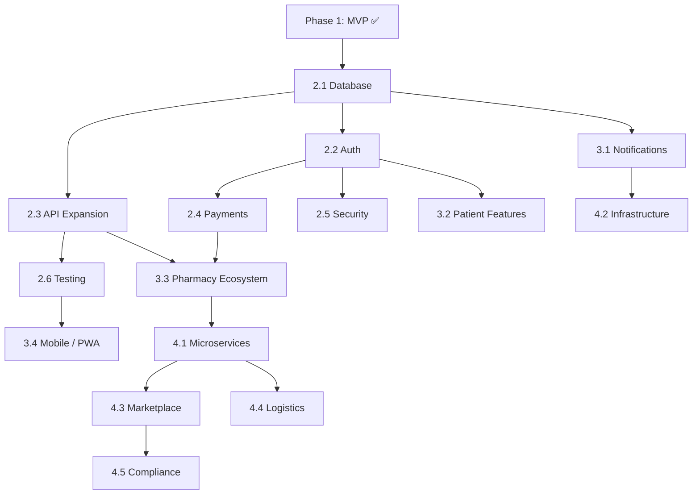

# 🚀 Development Phases — genericMed

> **Purpose:** Structured, phased development plan for evolving **genericMed** from MVP to a production-grade, scalable platform.
> AI assistants must consult this file to understand the current phase and prioritize work accordingly.
>
> **Current Phase:** Phase 1 — Foundation (MVP) ✅ → Transitioning to Phase 2
> **Last Updated:** 2026-09-08

---

## Phase Overview

```
Phase 1 ✅       Phase 2 🔲        Phase 3 🔲       Phase 4 🔲
Foundation       Production        Growth           Scale
(MVP)            Readiness         & Expansion      & Enterprise
─────────────────────────────────────────────────────────────────►
Sep 2026         Q4 2026           Q1-Q2 2027       Q3+ 2027
```

| Phase   | Name                  | Status         | Goal                                                        |
|---------|-----------------------|----------------|--------------------------------------------------------------|
| Phase 1 | Foundation (MVP)      | ✅ Complete     | Full UI for all 4 roles, AI scanner, price comparison engine |
| Phase 2 | Production Readiness  | 🔲 Not Started | Real database, auth, payments, security hardening            |
| Phase 3 | Growth & Expansion    | 🔲 Not Started | Mobile apps, multi-language, advanced analytics, integrations|
| Phase 4 | Scale & Enterprise    | 🔲 Not Started | Microservices, multi-region, marketplace model               |

---

## Phase 1 — Foundation (MVP) ✅

> **Goal:** Build a fully functional prototype demonstrating all core user flows across four roles.
> **Timeline:** Completed — September 2026

### Deliverables

- [x] **Multi-tenant role-based architecture** (Patient, Pharmacy, Admin, Doctor)
- [x] **Medicine search & price comparison** with pack size normalization
- [x] **AI prescription scanner** powered by Gemini 3.8 Flash
- [x] **Prescription upload & review workflow**
- [x] **Order lifecycle management** (Created → Delivered / Cancelled / Refunded)
- [x] **Cart & checkout flow** with delivery fees and tax computation
- [x] **Historical price trend charts** (Recharts)
- [x] **Client-side PDF generation** (jsPDF)
- [x] **Dark/Light theme system** with persistence
- [x] **Pharmacy portal** — orders, prescriptions, inventory management
- [x] **Admin dashboard** — audit logs, catalog management, support tickets
- [x] **Doctor prescribing view**
- [x] **Authentication UI** — login, register, role selection, account switching
- [x] **Toast notification system**
- [x] **In-app architecture documentation**
- [x] **Express backend** with embedded Vite dev server
- [x] **Sample prescription fallback data** (3 clinical samples)
- [x] **Comprehensive mock data layer** — medicines, pharmacies, offers, orders, users

### Known Limitations (to be addressed in Phase 2)

| Limitation                        | Impact                                      |
|-----------------------------------|---------------------------------------------|
| All data is in-memory (mock)      | Page refresh resets all state                |
| Auth is client-side only          | No real security; any user can access any role |
| No real payment processing        | Checkout flow is simulated                   |
| No input validation on uploads    | File type/size not enforced                  |
| No rate limiting on API endpoints | Vulnerable to abuse                          |
| Single-file backend (`server.ts`) | Will become unmanageable as endpoints grow   |

---

## Phase 2 — Production Readiness 🔲

> **Goal:** Replace all mock/simulated systems with real, production-grade implementations. Make the platform deployable and secure.
> **Timeline:** Q4 2026 (estimated)

### 2.1 — Database Integration

| Task | Priority | Depends On | Status |
|------|----------|------------|--------|
| Choose database (PostgreSQL vs MongoDB) and document in `decisions.md` | 🔴 Critical | — | 🔲 |
| Design database schema with migrations | 🔴 Critical | Database choice | 🔲 |
| Set up ORM/ODM (Prisma / Drizzle / Mongoose) | 🔴 Critical | Schema design | 🔲 |
| Migrate `mockData.ts` entities to database seed scripts | 🔴 Critical | ORM setup | 🔲 |
| Replace all `AppContext` in-memory CRUD with API calls | 🔴 Critical | Seed scripts | 🔲 |
| Add connection pooling and error handling | 🟡 High | ORM setup | 🔲 |

### 2.2 — Authentication & Authorization

| Task | Priority | Depends On | Status |
|------|----------|------------|--------|
| Implement server-side auth (JWT or session-based) | 🔴 Critical | Database | 🔲 |
| Add password hashing (bcrypt / argon2) | 🔴 Critical | Auth system | 🔲 |
| Create auth middleware for protected API routes | 🔴 Critical | Auth system | 🔲 |
| Implement role-based access control (RBAC) on server | 🔴 Critical | Auth middleware | 🔲 |
| Add refresh token rotation | 🟡 High | JWT auth | 🔲 |
| Add forgot password / reset flow | 🟡 High | Email service | 🔲 |
| Add OAuth providers (Google, optional) | 🟢 Low | Auth system | 🔲 |

### 2.3 — API Expansion

| Task | Priority | Depends On | Status |
|------|----------|------------|--------|
| Refactor `server.ts` into modular route files (`src/api/`) | 🔴 Critical | — | 🔲 |
| Create RESTful endpoints for all CRUD operations | 🔴 Critical | Database | 🔲 |
| Add request validation middleware (Zod / Joi) | 🔴 Critical | API routes | 🔲 |
| Add rate limiting (express-rate-limit) | 🟡 High | API routes | 🔲 |
| Add CORS configuration for production | 🟡 High | — | 🔲 |
| API documentation (OpenAPI / Swagger) | 🟢 Low | API routes | 🔲 |

**Planned API Structure:**

```
src/api/
├── auth.ts           # Login, register, refresh, logout
├── medicines.ts      # CRUD for medicine catalog
├── offers.ts         # Price offers from pharmacies
├── prescriptions.ts  # Upload, review, list prescriptions
├── orders.ts         # Create, update, track orders
├── cart.ts           # Cart operations
├── users.ts          # User profile management
├── admin.ts          # Admin-only endpoints
├── audit.ts          # Audit log queries
└── middleware/
    ├── auth.ts       # JWT verification
    ├── rbac.ts       # Role-based access control
    ├── validate.ts   # Request validation
    └── rateLimit.ts  # Rate limiting
```

### 2.4 — Payment Gateway

| Task | Priority | Depends On | Status |
|------|----------|------------|--------|
| Choose payment provider (Razorpay / Stripe) and document in `decisions.md` | 🟡 High | — | 🔲 |
| Integrate payment SDK on frontend | 🟡 High | Provider choice | 🔲 |
| Create payment verification endpoint on server | 🟡 High | Provider choice | 🔲 |
| Implement webhook handler for payment status updates | 🟡 High | Payment endpoint | 🔲 |
| Add refund processing logic | 🟡 High | Payment system | 🔲 |
| Payment receipt PDF generation | 🟢 Low | Payment system | 🔲 |

### 2.5 — Security Hardening

| Task | Priority | Depends On | Status |
|------|----------|------------|--------|
| Add Helmet.js for HTTP security headers | 🟡 High | — | 🔲 |
| Implement CSRF protection | 🟡 High | Auth system | 🔲 |
| Add input sanitization (DOMPurify for user content) | 🟡 High | — | 🔲 |
| Parameterized queries only (no SQL injection risk) | 🔴 Critical | Database | 🔲 |
| File upload validation (type, size, virus scan) | 🟡 High | — | 🔲 |
| Implement audit logging on server side | 🟡 High | Database | 🔲 |
| Add HTTPS enforcement in production | 🟡 High | Deployment | 🔲 |

### 2.6 — Testing

| Task | Priority | Depends On | Status |
|------|----------|------------|--------|
| Set up testing framework (Vitest) | 🟡 High | — | 🔲 |
| Unit tests for utility functions | 🟡 High | Vitest | 🔲 |
| Component tests (React Testing Library) | 🟡 High | Vitest | 🔲 |
| API integration tests (Supertest) | 🟡 High | API routes | 🔲 |
| E2E tests (Playwright) | 🟢 Low | All features | 🔲 |
| CI/CD pipeline (GitHub Actions) | 🟡 High | Tests | 🔲 |

### Phase 2 Exit Criteria

- [ ] All data persisted in a real database — no in-memory mock state
- [ ] Server-side authentication with RBAC on every endpoint
- [ ] At least one real payment provider integrated
- [ ] All API endpoints validated, rate-limited, and documented
- [ ] Test coverage ≥ 60% for critical paths
- [ ] CI/CD pipeline running on every push
- [ ] Security audit checklist passed

---

## Phase 3 — Growth & Expansion 🔲

> **Goal:** Expand platform reach, improve UX with advanced features, and integrate with real-world pharmacy systems.
> **Timeline:** Q1–Q2 2027 (estimated)

### 3.1 — Communication & Notifications

| Task | Priority | Status |
|------|----------|--------|
| Email service integration (SendGrid / AWS SES) | 🟡 High | 🔲 |
| Order confirmation emails | 🟡 High | 🔲 |
| Prescription status notification emails | 🟡 High | 🔲 |
| Delivery status push notifications | 🟢 Low | 🔲 |
| SMS notifications (Twilio, optional) | 🟢 Low | 🔲 |

### 3.2 — Advanced Patient Features

| Task | Priority | Status |
|------|----------|--------|
| Medicine search autocomplete with fuzzy matching | 🟡 High | 🔲 |
| AI-powered drug interaction checker | 🟡 High | 🔲 |
| Patient medical history / medication records | 🟡 High | 🔲 |
| Medicine reminders / dosage schedule | 🟢 Low | 🔲 |
| Saved addresses and payment methods | 🟡 High | 🔲 |
| Wishlist / saved medicines | 🟢 Low | 🔲 |

### 3.3 — Pharmacy Ecosystem

| Task | Priority | Status |
|------|----------|--------|
| Real pharmacy API integrations (inventory, pricing) | 🔴 Critical | 🔲 |
| Pharmacy self-onboarding portal | 🟡 High | 🔲 |
| Pharmacy rating & review system | 🟡 High | 🔲 |
| Bulk price upload (CSV/Excel import) | 🟡 High | 🔲 |
| Pharmacy analytics dashboard | 🟢 Low | 🔲 |

### 3.4 — Mobile & Multi-Platform

| Task | Priority | Status |
|------|----------|--------|
| Progressive Web App (PWA) — offline support, installable | 🟡 High | 🔲 |
| React Native mobile app (iOS + Android) | 🟢 Low | 🔲 |
| Responsive design audit and optimization | 🟡 High | 🔲 |

### 3.5 — Localization & Accessibility

| Task | Priority | Status |
|------|----------|--------|
| Multi-language support (i18n framework) | 🟡 High | 🔲 |
| Hindi, Tamil, Telugu, Kannada translations | 🟡 High | 🔲 |
| WCAG 2.1 AA compliance audit | 🟡 High | 🔲 |
| Screen reader optimization | 🟡 High | 🔲 |

### 3.6 — Advanced Analytics

| Task | Priority | Status |
|------|----------|--------|
| Admin analytics dashboard with real data | 🟡 High | 🔲 |
| Sales and revenue reports with data export | 🟡 High | 🔲 |
| User behavior analytics (PostHog / Mixpanel) | 🟢 Low | 🔲 |
| Medicine demand forecasting (ML) | 🟢 Low | 🔲 |

### Phase 3 Exit Criteria

- [ ] Email notifications functional for all critical flows
- [ ] At least 3 real pharmacy partners integrated
- [ ] PWA installable with core offline functionality
- [ ] Multi-language support for at least 2 Indian languages
- [ ] Drug interaction checker operational
- [ ] Admin analytics dashboard with real, queryable data

---

## Phase 4 — Scale & Enterprise 🔲

> **Goal:** Architect for scale, enable marketplace economics, and support enterprise-grade operations.
> **Timeline:** Q3+ 2027 (estimated)

### 4.1 — Architecture Evolution

| Task | Priority | Status |
|------|----------|--------|
| Decompose monolith into microservices | 🟡 High | 🔲 |
| API gateway (Kong / AWS API Gateway) | 🟡 High | 🔲 |
| Message queue for async processing (RabbitMQ / SQS) | 🟡 High | 🔲 |
| Event-driven architecture for order/prescription flows | 🟡 High | 🔲 |
| CDN for static assets and edge caching | 🟡 High | 🔲 |

### 4.2 — Infrastructure & DevOps

| Task | Priority | Status |
|------|----------|--------|
| Container orchestration (Kubernetes / ECS) | 🟡 High | 🔲 |
| Multi-region deployment | 🟢 Low | 🔲 |
| Database read replicas and sharding strategy | 🟢 Low | 🔲 |
| Centralized logging (ELK / CloudWatch) | 🟡 High | 🔲 |
| Distributed tracing (OpenTelemetry) | 🟢 Low | 🔲 |
| Disaster recovery and backup automation | 🟡 High | 🔲 |

### 4.3 — Marketplace Model

| Task | Priority | Status |
|------|----------|--------|
| Commission-based revenue model | 🟡 High | 🔲 |
| Pharmacy subscription tiers (Basic / Premium / Enterprise) | 🟡 High | 🔲 |
| Promoted listings / sponsored placements | 🟢 Low | 🔲 |
| Settlement and payout system for pharmacies | 🟡 High | 🔲 |

### 4.4 — Logistics & Delivery

| Task | Priority | Status |
|------|----------|--------|
| Delivery partner integration (Dunzo / Swiggy Instamart) | 🟡 High | 🔲 |
| Real-time delivery tracking with maps | 🟡 High | 🔲 |
| Delivery slot scheduling | 🟢 Low | 🔲 |
| Return and reverse logistics | 🟢 Low | 🔲 |

### 4.5 — Compliance & Governance

| Task | Priority | Status |
|------|----------|--------|
| HIPAA-equivalent data protection compliance | 🔴 Critical | 🔲 |
| Drug licensing and regulatory API integration | 🟡 High | 🔲 |
| Automated compliance reporting | 🟢 Low | 🔲 |
| Data retention and right-to-deletion policies | 🟡 High | 🔲 |

### Phase 4 Exit Criteria

- [ ] Microservices architecture deployed with API gateway
- [ ] Sub-200ms p95 API response times under load
- [ ] Multi-region failover tested and operational
- [ ] Marketplace commission model live with settlement system
- [ ] At least one delivery partner integrated with real-time tracking
- [ ] Compliance audit passed for applicable regulations

---

## Cross-Phase Dependencies



---

## Decision Checkpoints

> Before starting each phase, the following decisions must be documented in `decisions.md`:

### Phase 2 Decisions Required

- [ ] **DEC-XXX:** Database choice — PostgreSQL vs MongoDB vs other
- [ ] **DEC-XXX:** ORM choice — Prisma vs Drizzle vs TypeORM vs Mongoose
- [ ] **DEC-XXX:** Auth strategy — JWT vs session-based vs Auth0/Clerk
- [ ] **DEC-XXX:** Payment provider — Razorpay vs Stripe vs both
- [ ] **DEC-XXX:** Testing framework — Vitest vs Jest
- [ ] **DEC-XXX:** CI/CD platform — GitHub Actions vs other

### Phase 3 Decisions Required

- [ ] **DEC-XXX:** Email provider — SendGrid vs AWS SES vs Resend
- [ ] **DEC-XXX:** i18n framework — react-i18next vs FormatJS
- [ ] **DEC-XXX:** Mobile strategy — PWA-only vs React Native vs both
- [ ] **DEC-XXX:** Analytics provider — PostHog vs Mixpanel vs custom

### Phase 4 Decisions Required

- [ ] **DEC-XXX:** Microservices communication — REST vs gRPC vs GraphQL
- [ ] **DEC-XXX:** Container orchestration — Kubernetes vs ECS vs Cloud Run
- [ ] **DEC-XXX:** Message broker — RabbitMQ vs Kafka vs SQS
- [ ] **DEC-XXX:** Delivery partner(s) — market evaluation needed

---

> **Maintenance Rule:** Update phase statuses, mark tasks as complete, and adjust timelines as the project evolves. When all tasks in a phase are done, mark the phase as ✅ and update the "Current Phase" at the top of this file.
